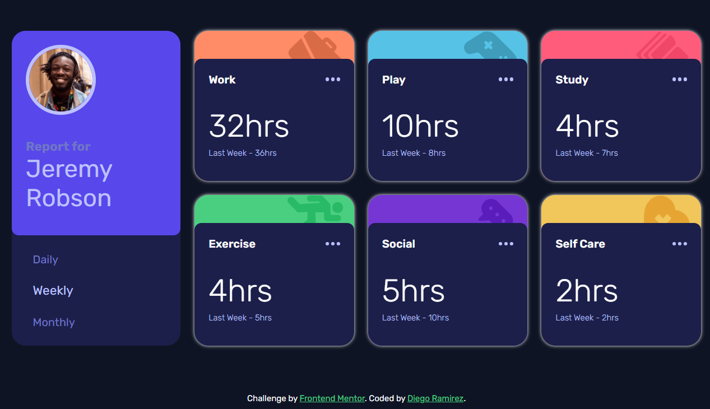

# Frontend Mentor - Time tracking dashboard solution

This is a solution to the [Time tracking dashboard challenge on Frontend Mentor](https://www.frontendmentor.io/challenges/time-tracking-dashboard-UIQ7167Jw). Frontend Mentor challenges help you improve your coding skills by building realistic projects. 

## Table of contents

- [Overview](#overview)
  - [The challenge](#the-challenge)
  - [Screenshot](#screenshot)
  - [Links](#links)
- [My process](#my-process)
  - [Built with](#built-with)
  - [What I learned](#what-i-learned)
  - [Continued development](#continued-development)
- [Author](#author)

## Overview

### The challenge

Users should be able to:

- View the optimal layout for the site depending on their device's screen size
- See hover states for all interactive elements on the page
- Switch between viewing Daily, Weekly, and Monthly stats

### Screenshot



### Links

- Solution URL: [github](https://github.com/Diego2Drm/Time-tracking-dashboard)
- Live Site URL: [Time-tracking-dashboard](https://diego2drm.github.io/Time-tracking-dashboard/#/weekly)

## My process

### Built with

- Semantic HTML5 markup
- CSS custom properties
- Flexbox
- CSS Grid
- Mobile-first workflow
- [React](https://reactjs.org/) - JS library
- TypeScript
- React Router Dom

### What I learned

I learned props whit TypeScript

```html
```
```tsx
type CardInfoProps = {
  title: string;
  date: string;
  current: number;
  previous: number;
}

const CardInfo: React.FC<CardInfoProps> = ({title,current,previous, date}) => {
  return (
    <>
      <div>
        <h3>{title}</h3>
        
      </div>
      <div>
        <p>{current}hrs</p>
        <p>Last {date} - {previous}hrs</p>
      </div>
    </>
  );
};

```

### Continued development

-React js + TypeScript

## Author

- Frontend Mentor - [@Diego2Drm](https://www.frontendmentor.io/profile/Diego2Drm)
- Gmail - [diego.ramirez2d03@gmail.com]